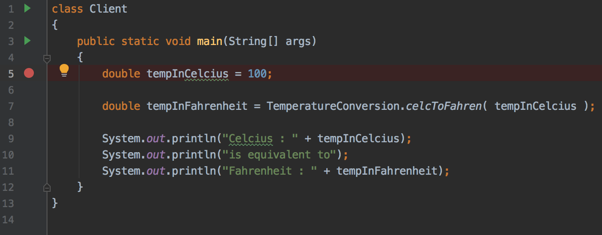
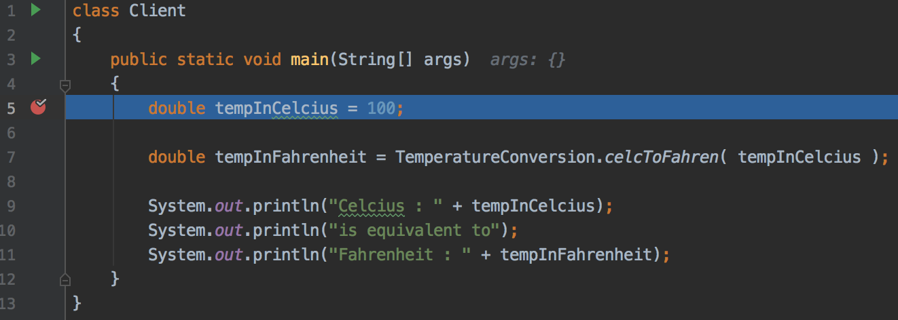
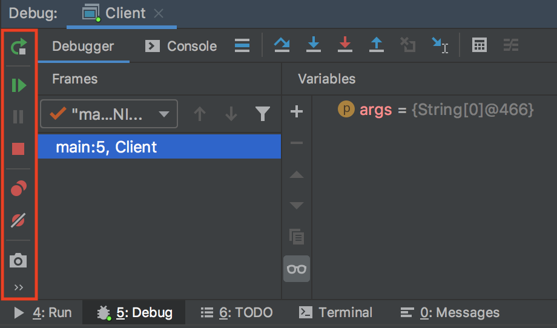
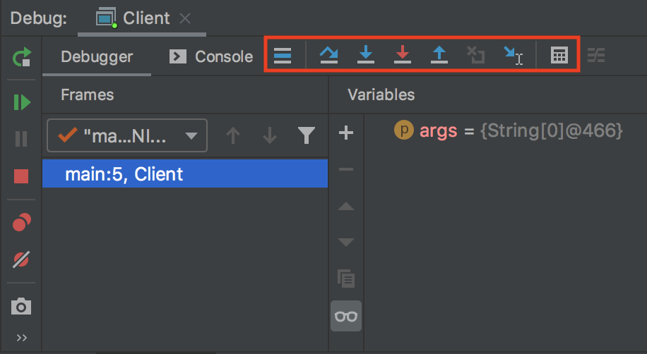
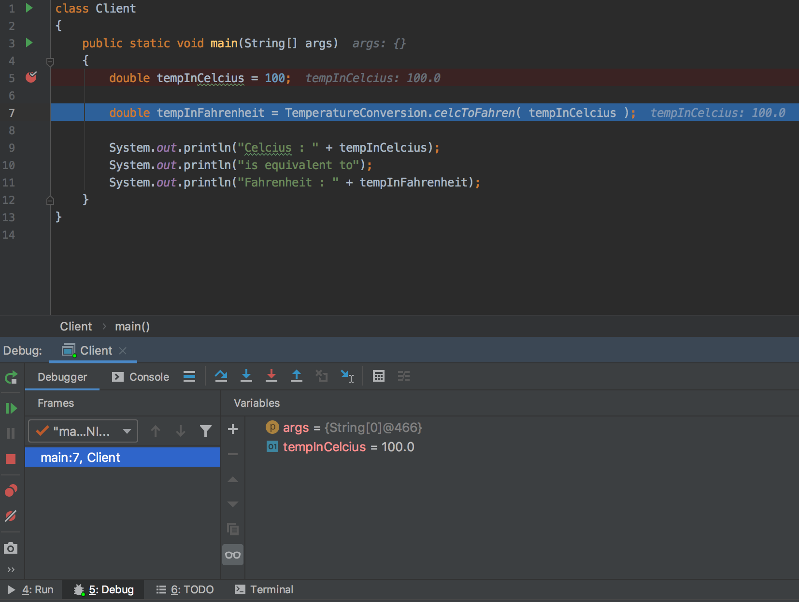
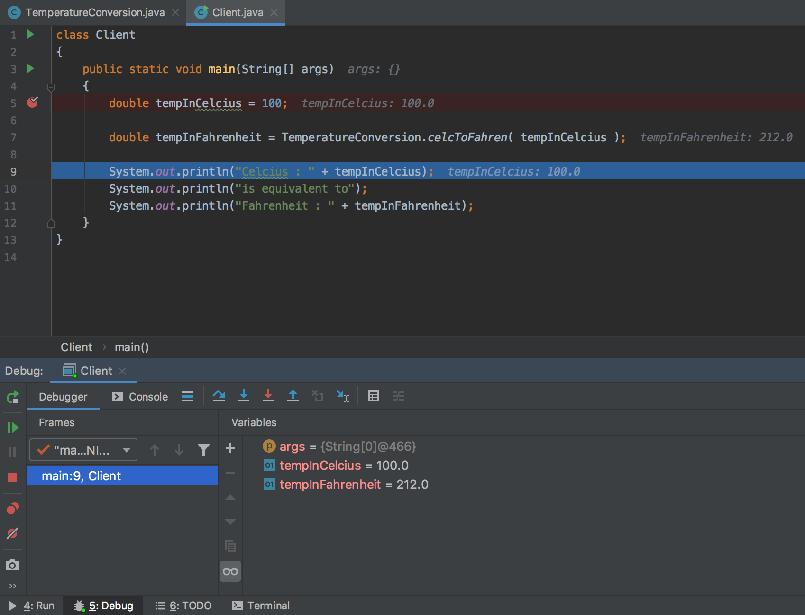

## Using IntelliJ's Debugger

IntelliJ has a built-in debugger, which lets you step through your code line by line and check the values of variables and constants in the current scope.

We will be using these files to demonstrate the debugger:

<a name="temperatureConversion"></a>

```java
class TemperatureConversion
{
    final static double CELC_FAHREN_RATIO = 9.0/5;
    final static int FAHREN_FREEZE_POINT = 32;

    // takes as an argument (input) the temperature in celcius (as a double)
    // returns (outputs) the temperature in fahrenheit (as a double)
    static double celcToFahren(double tempInCelc)
    {
        return tempInCelc * CELC_FAHREN_RATIO + FAHREN_FREEZE_POINT;
    }

    // argument : temperature in fahrenheit, as a double
    // return : temperature in celcius, as a double
    static double fahrenToCelc(double tempInFahren)
    {
        // TODO
        return 0; // replace this return with a correct conversion
    }
}
```

<a name="exClientClass"></a>

```java
class TemperatureConversionClient
{
    public static void main(String[] args)
    {
        double tempInCelcius = 100;

        double tempInFahrenheit = TemperatureConversion.celcToFahren( tempInCelcius );

        System.out.println("Celcius : " + tempInCelcius);
        System.out.println("is equivalent to");
        System.out.println("Fahrenheit : " + tempInFahrenheit);
    }
}
```

In a project consisting of the [`TemperatureConversion`](../README.md#temperatureConversion) class and its [client](../README.md#exClientClass) class provided above, set a **break point** on the line with the statement `double tempInCelcius = 100;`. You can set a break point on any line by clicking in between the editor pane's line numbers and the text editor itself. A red dot will appear on the line, denoting that there is a break point there:



The break point tells the debugger **where to stop** to wait for your instruction; once you run the debugger, the program will run until it hits a break point, and then stop and wait. You can then use the debugger controls to move the program forward step by step.

Once you've placed the break point, go to the `Run` menu, select `Debug...` and in the dialog that pops up select your client class.

The program should begin running, and stop at the break point. The break point will now be highlighted in blue, denoting where the debugger is stopped in its execution of the program:



The line highlighted in blue **has not yet been executed**. Program execution stopped just **before** the statement on this line could run. You can think of the break point as being at the start of the line, before the statement itself.

The debugger pane should have popped up at the bottom of the IntelliJ window, where the console normally is for normal runs:


You can mouse over any of the buttons in this debugger pane, and a small tooltip will appear in the bottom left of the IntelliJ window briefly describing the button's function:


There is a vertical toolbar on the left, outlined in red below. From top to bottom, these buttons:

* **Rerun Program**: Run the program again from the beginning.
* **Continue Program Execution**: Run the program until it hits the next break point.
* **Pause Program**: Pauses the program wherever it is in execution. This button is useful when the program is stuck in a loop somewhere, so it's just running forever, and you'd like to find out where the offending code is.
* **Stop Program Execution**: Pretty straightforward, terminate the program.
* **Show Breakpoints**: Breakpoints are displayed in a new window which pops up, specifying what files the breakpoints are in and which lines they're on, among other things.
* **Mute Breakpoints**: The debugger will not stop at breakpoints while they are muted.
* **Get Thread Dump**: Outside of the scope of what we'll be using the debugger for.



In the variables pane, you can see a list of all variables which are accessible from the scope of the current statement:


Currently, the statement declaring `tempInCelcius` has not been executed yet, so it is not visible in the variables pane. The only variable that we can see in the pane is the `args` variable (which you can see is the only input for the main method). We'll talk more about the `args` list, and what data is contained in it, when we cover arrays in a future lab.

Finally, the debugger controls can be used to follow the program through its execution as desired. From left to right, the buttons outlined in red in the picture below do the following:

* **Show Execution Point**: Opens the file at which execution is currently stopped, and moves your cursor to the line it is stopped on.
* **Step Over**: Steps to the next line in the current file; if the current line uses another file (say, it calls a method defined in another file), you will not enter that function definition to step through it.
* **Step Into**: Steps to the next line executed, in this file or a different file. If the current execution line calls a method defined in another file, the debugger will step into that method, so you can go through it line by line.
* **Force Step Into**: A more inclusive "step into". Step into will not step into some library functions, where force step into will.
* **Step Out**: Continue execution until leaving the current method / scope, then stop.
* **Drop Frame**: Leave the current method by returning to where it was called, essentially allowing you to step "back in time" to just before the method being executed was called. Use this carefully, as changes made to non-local data (e.g. object references passed in as arguments) will not be reversed.
* **Run To Cursor**: Continue execution until reaching the line where the cursor is.
* **Expression Calculator**: Opens a window which allows you to type expressions (using variables in the current scope) and see what those expressions evaluate to.



Try using the **Step Into** button to move to the next line. You should end up here:



Execution has now stopped just before the statement on line 7 in the picture above. The statement on line 5 has been executed, and the `tempInCelcius` variable is now visible in the variables pane.

Notice that line 7 contains a call to the method `TemperatureConversion.celcToFahren`. On this line, we are faced with a choice. If we hit the **Step Into**, we will step into the `celcToFahren` function, where we can go through it line by line. If we hit **Step Over** we will fully execute this call to `celcToFahren` without walking through it, and continue executing until reaching the next line in `Client.java`, which is line 9 in the image above.

To clarify, in either case the `celcToFahren` method call will happen, but we will not go through it line-by-line if we step over it.

Hit **Step Into**. You should end up here:


Note that the `tempInCelc` variable now visible in the variables pane is **not** the same one that we could see back in the client. This is a new variable, an **argument** for the `celcToFahren` method, which has been given a copy of the value of the variable that was passed into `celcToFahren` in the client.

If you hit the **Drop Frame** button, you can step back into the client, just before `celcToFahren` was called. This is useful if you want to start the `celcToFahren` execution over to step through it again.

If you hit **Step Over**, **Step Into**, or **Step Out**, the result will be to finish the execution of the `celcToFahren` function (because we are already on its last line) and return to the client, where execution will resume on the line after the method call. Hit one these three buttons, and you should end up here:



(If you chose **Step Out** above you would actually end up back on line 7, but **after** the method call was completed, and you'd need to **Step Into** or **Step Over** to get to where the image above is).

Now, the variable `tempInFahrenheit` is visible in the variables pane. It has been assigned the value that was output by the `celcToFahren` call. Moreover, we already know that water boils at 100 degrees Celcius and 212 degrees Fahrenheit, so it appears that `celcToFahren` returned the correct result! This doesn't necessarily mean that `celcToFahren` is **always** correct, just that it is correct when converting 100 degrees Celcius to Fahrenheit.

Many programmers are tempted to debug their software by printing status messages to the console stating the values of variables and other pertinent information. This is generally bad practice except in niche cases where the debugger isn't helpful for one reason or another. It's bad practice for a few reasons, but the primary one is that it is **tedious** and **slow**, whereas using the debugger is **easy** and **fast** once you're used to it!
